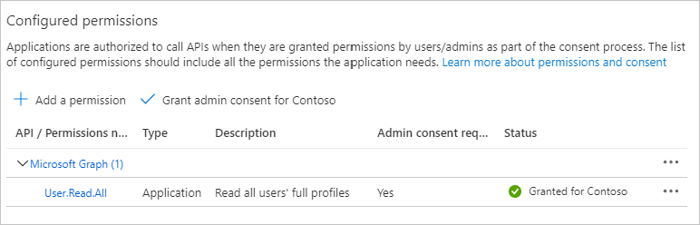
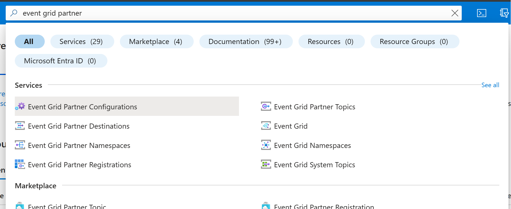
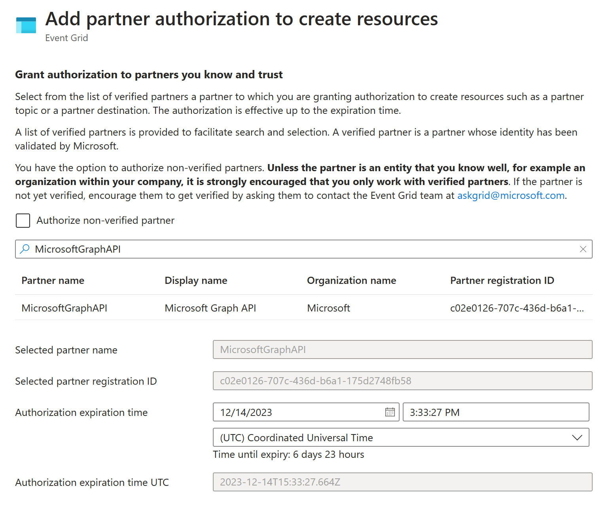
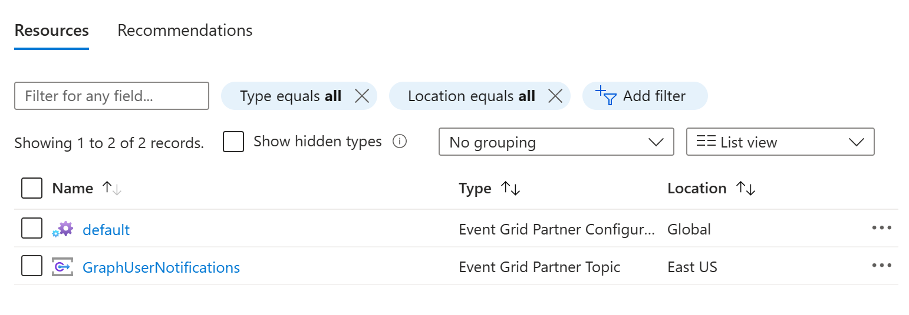
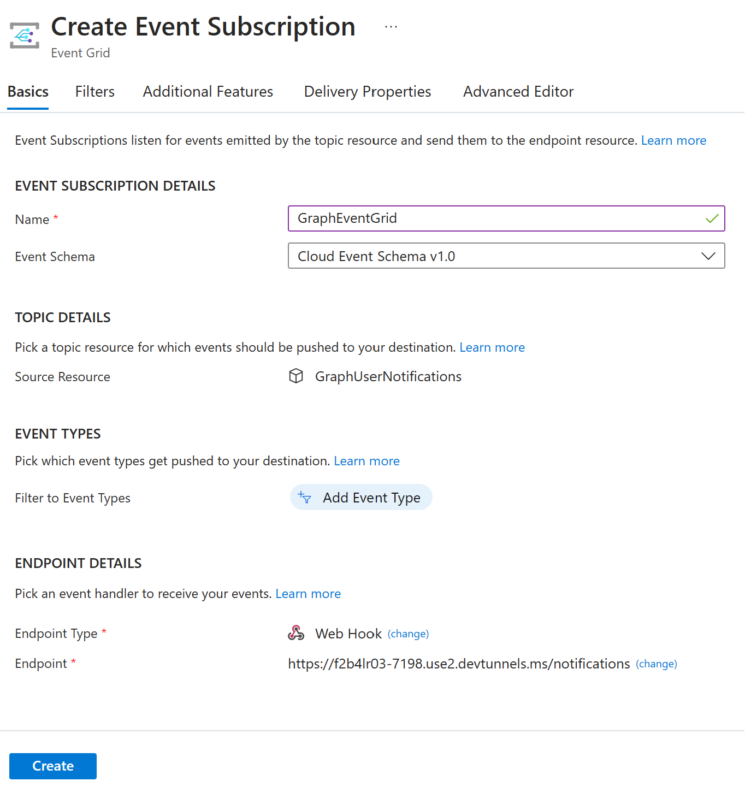

# Microsoft Graph Event Grid change notifications sample for .NET


Subscribe for [Microsoft Graph change notifications](https://learn.microsoft.com/graph/api/resources/webhooks) to be notified when your user's data changes, so you don't have to poll for changes.

This sample Java Spring web application shows how to subscribe for change notifications to be [delivered to Azure Event Grid](https://learn.microsoft.com/azure/event-grid/subscribe-to-graph-api-events).

This sample uses:

- The [Microsoft Graph SDK for Java](https://github.com/microsoftgraph/msgraph-sdk-java) (SDK) to call Microsoft Graph.
- The [Azure Identity client library for Java](https://github.com/Azure/azure-sdk-for-java/blob/main/sdk/identity/azure-identity/README.md) library to handle authentication for Microsoft Graph.

## Prerequisites

- [Java 17 or later](https://www.microsoft.com/openjdk) or later.
- The [.NET dev tunnel CLI](https://learn.microsoft.com/azure/developer/dev-tunnels/get-started).
- A Microsoft work or school account with the Global administrator role. If you don't have one, you can get a developer sandbox by joining the [Microsoft 365 developer program](https://developer.microsoft.com/microsoft-365/dev-program).
- An Azure subscription. If you don't have one, you can [start a free trial](https://azure.microsoft.com/free/).

## Create Azure resources

In order to configure the sample, you'll need to do the following steps in the Azure portal.

- [Register an application](#register-an-application) for authenticating to Microsoft Graph.
- [Create a resource group](#create-a-resource-group) where Microsoft Graph can create [partner topics for Event Grid](https://learn.microsoft.com/azure/event-grid/subscribe-to-partner-events).
- [Authorize Microsoft Graph to create partner topics](#authorize-microsoft-graph-to-create-partner-topics) in the resource group.

### Register an application

1. Open a browser and navigate to the [Azure Active Directory admin center](https://aad.portal.azure.com) and login using a Global administrator account.

1. Select **Microsoft Entra ID** in the left-hand navigation, then select **App registrations** under **Manage**.

1. Select **New registration**. Enter a name for your application, for example, `Event Grid Change Notifications Sample`.

1. Set **Supported account types** to **Accounts in this organizational directory only**.

1. Leave **Redirect URI** empty.

1. Select **Register**. On the application's **Overview** page, copy the value of the **Application (client) ID** and **Directory (tenant) ID** and save them, you will need these values in the next step.

1. Select **API permissions** under **Manage**.

1. Remove the default **User.Read** permission under **Configured permissions** by selecting the ellipses (**...**) in its row and selecting **Remove permission**.

1. Select **Add a permission**, then **Microsoft Graph**.

1. Select **Application permissions**.

1. Select **User.Read.All**, then select **Add permissions**.

1. Select **Grant admin consent for...**, then select **Yes** to provide admin consent for the selected permission.

    

1. Select **Certificates and secrets** under **Manage**, then select **New client secret**.

1. Enter a description, choose a duration, and select **Add**.

1. Copy the secret from the **Value** column, you will need it in the next steps.

    > [!IMPORTANT]
    > This client secret is never shown again, so make sure you copy it now.

### Create a resource group

1. Open a browser and navigate to the [Azure Active Directory admin center](https://aad.portal.azure.com) and login using a Global administrator account.

1. Select **Resource groups** in the left-hand navigation, then select **Create**.

1. Select the Azure subscription and region to create the resource group in, and provide a name for the resource group, then select **Review + create**.

1. Once the validation completes, select **Create**.

### Authorize Microsoft Graph to create partner topics

1. Open a browser and navigate to the [Azure Active Directory admin center](https://aad.portal.azure.com) and login using a Global administrator account.

1. Search for **Event Grid Partner Configurations** and select it from the results.

    

1. Select **Create**.

1. Select the Azure subscription and the resource group you created in the previous step.

1. Select **Partner Authorization**.

1. Search for **MicrosoftGraphAPI** and select it. Select **Add**.

    

1. Select **Review + create**. Once the validation completes, select **Create**.

## Configure the sample

Create a new file named **application.yml** in the **./grapheventgrid/src/main/resources** directory and add the following.

```yml
azure:
  tenant-id: YOUR_TENANT_ID
  client-id: YOUR_CLIENT_ID
  client-secret: 'YOUR_CLIENT_SECRET'
  subscription-id: YOUR_AZURE_SUBSCRIPTION_ID
  resource-group: YOUR_EVENT_GRID_RESOURCE_GROUP
  event-grid-topic: YOUR_EVENT_GRID_TOPIC
  location: YOUR_AZURE_LOCATION
```

Set the values as follows.

| Setting | Value |
|---------|-------|
| `tenant-id` | The **Directory (tenant) ID** from your app registration. |
| `client-id` | The **Application (client) ID** from your app registration. |
| `client-secret` | The client secret from your app registration. |
| `subscription-id` | The ID of your Azure subscription. This can be found in the Azure portal. Search for **Subscriptions** and select it from the results. |
| `resource-group` | The name of the resource group you created in the previous steps. |
| `event-grid-topic` | The name Microsoft Graph should use to create the partner topic, for example: `EventGridNotifications`. |
| `location` | The location you created your resource group in. You can find this by running the following command in Cloud Shell in the Azure portal: `az account list-locations`. Use the `name` value for the location, for example: `eastus`. |

## Create a dev tunnel

A dev tunnel will allow Azure Event Grid to reach the sample running on your development machine.

1. Run the following command to login to the dev tunnel service. You can login with either a Microsoft Azure Active Directory account, a Microsoft account, or a GitHub account.

    ```powershell
    devtunnel user login
    ```

1. Run the following commands to create a tunnel. Copy the **Tunnel ID** from the output.

    ```powershell
    devtunnel create --allow-anonymous
    ```

1. Run the following command to assign the sample's port (8080) to the tunnel. Replace `tunnel-id` with the **Tunnel ID** copied in the previous step.

    ```powershell
    devtunnel port create tunnel-id -p 8080
    ```

1. Run the following command to host the tunnel. Replace `tunnel-id` with the **Tunnel ID** copied in the previous step.

    ```bash
    devtunnel host tunnel-id
    ```

1. Copy the URL labeled **Connect via browser**. Open this URL in your browser and select **Continue** to enable the tunnel.

## Run the sample

1. Run the sample with the following command in the **grapheventgrid** directory. Alternatively, you can press **F5** in Visual Studio Code.

    ```bash
    gradlew run bootRun
    ```

1. Monitor the output. When you see the following, proceed to the next step.

    ```bash
    Created new subscription with ID 4264cf0b-1c5d-4ab0-8097-cc96b894634a
    Please activate the GraphUserNotifications partner topic in the Azure portal and create an event subscription. See README for details.
    ```

1. In the Azure portal, navigate to the resource group you created. It should contain a new Event Grid Partner Topic. Select this topic.

    

1. Select **Activate**.

1. Select **Event Subscription** to add a new subscription.

1. Provide a name for the subscription, then set **Endpoint Type** to **Webhook**.

1. Select **Configure an endpoint**. Enter your dev tunnel URL. Select **Confirm Selection**.

1. Select **Create** and wait for the deployment to succeed.



## Generate events

Using the Azure portal or the [Microsoft admin center](https://admin.microsoft.com), add, update, or delete users. Watch the sample's output for the notifications.

```bash
Received Microsoft.Graph.UserUpdated notification from Event Grid
User Adele Vance (ID: 37a7dc1b-812b-4336-8210-76b2180b574a) was created or updated
```

## Code of conduct

This project has adopted the [Microsoft Open Source Code of Conduct](https://opensource.microsoft.com/codeofconduct/). For more information see the [Code of Conduct FAQ](https://opensource.microsoft.com/codeofconduct/faq/) or contact [opencode@microsoft.com](mailto:opencode@microsoft.com) with any additional questions or comments.
